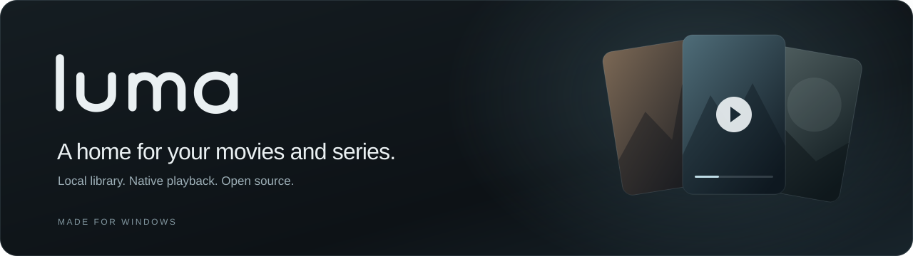

<p align="center">
  
</p>

<p align="center">
  <strong>A media library for Windows, with an Android companion in preview.</strong><br />
  Bring your movies, series, playback and subtitles together in one quiet interface.
</p>

<p align="center">
  <a href="https://github.com/mrlcache/luma-media-library/releases/download/v0.2.2/Luma_0.2.2_x64-setup.exe"><strong>Download for Windows ↗</strong></a>
  &nbsp; · &nbsp;
  <a href="https://github.com/mrlcache/luma-media-library/releases/download/v0.2.2/Luma-Mobile-0.2.2-armv7.apk"><strong>Android preview APK ↗</strong></a>
  &nbsp; · &nbsp;
  <a href="https://github.com/mrlcache/luma-media-library/releases">Release notes</a>
  &nbsp; · &nbsp;
  <a href="docs/development.md">Build from source</a>
  &nbsp; · &nbsp;
  <a href="https://github.com/mrlcache/luma-media-library/issues">Report an issue</a>
</p>

<p align="center"><sub>v0.2.2 preview &nbsp; / &nbsp; Windows x64 + Android ARM32 &nbsp; / &nbsp; GPL-2.0-or-later</sub></p>

---

## Your collection, in one place

Luma turns the folders you choose into a searchable movie and TV library. Browse artwork and title details, pick up where you left off, and watch your own files with native MPV playback.

| Browse | Watch | Make it yours |
| :--- | :--- | :--- |
| Index your local movie and series folders. | Play video with the bundled MPV engine. | Load your own subtitle files. |
| Find titles with search, posters and metadata. | Keep playback history and resume progress. | Adjust subtitle font, size and position. |
| Manage torrent downloads inside the app. | Use the alternative VLC engine when available. | Find subtitles through OpenSubtitles. |

Your catalog and playback history are stored locally. Luma does not include movies, series or a demo collection.

## Get started

1. **Install Luma.** [Download the Windows installer](https://github.com/mrlcache/luma-media-library/releases/download/v0.2.2/Luma_0.2.2_x64-setup.exe), open the `.exe`, and follow the installation wizard.
2. **Add your collection.** Open **Settings → Local library → Choose folder** and select a folder containing your videos. Use **Add folder** for another location.
3. **Pick something to watch.** Browse your library and press **Play**. Subtitle controls are available in the player.

MPV and the torrent engine are included in the installer. Metadata and artwork use online services; TMDb credentials must be configured in the local app profile. OpenSubtitles search and downloads use your own API key and account. Local playback works with your own files.

## Android companion preview

[Download the APK](https://github.com/mrlcache/luma-media-library/releases/download/v0.2.2/Luma-Mobile-0.2.2-armv7.apk) and use **Find computers** or enter your computer's address to pair with the matching Windows build on your private network. The companion browses your PC library, resumes playback, and can request HLS transcoding for formats the phone cannot play directly. It also offers a separate phone download destination.

This APK targets **ARM32 / armeabi-v7a and Android 8 or newer**, including the Galaxy A02s. ARM64-only devices need a separate build. It embeds the interface, requires no development web server, and contains no sample media or embedded service credentials. It is a **debug-signed testing build**, not a production Android release. Playback on every device, codec, subtitle format, and casting target has not been validated.

The Windows installer and APK are available together in the [0.2.2 preview release](https://github.com/mrlcache/luma-media-library/releases/tag/v0.2.2). See [Android build instructions](docs/android-demo.md), [Wi-Fi development](docs/android-wifi-dev.md), and the [code review findings](docs/audit-2026-10-05.md).

## Built with

Luma uses **Svelte 5** for the interface, **Tauri 2 and Rust** for the desktop shell, **SQLite** for the catalog, **MPV** for native playback, and **libtorrent** for downloads.

The development app supports live frontend updates:

```powershell
npm ci
npm run desktop:dev
```

Native builds need the Windows C++ and Rust toolchains. See the [development guide](docs/development.md) for prerequisites, production builds and checks.

## Need a hand?

- [Troubleshooting](docs/troubleshooting.md) — missing artwork, playback errors and app profiles.
- [Issues](https://github.com/mrlcache/luma-media-library/issues) — report a bug or suggest an improvement. Include your Luma version, steps to reproduce, and a screenshot when useful.
- [Releases](https://github.com/mrlcache/luma-media-library/releases) — Windows installers, Android preview APKs and changes by version.

## Open source

Luma is licensed under [GPL-2.0-or-later](LICENSE). Third-party components retain their own licenses; see [third-party notices](THIRD_PARTY_NOTICES.md).
